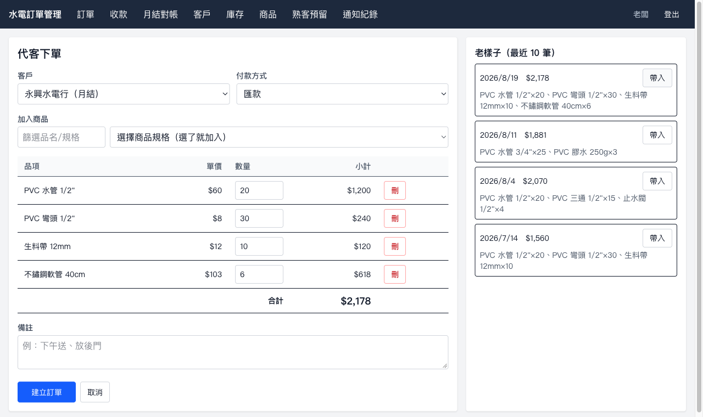
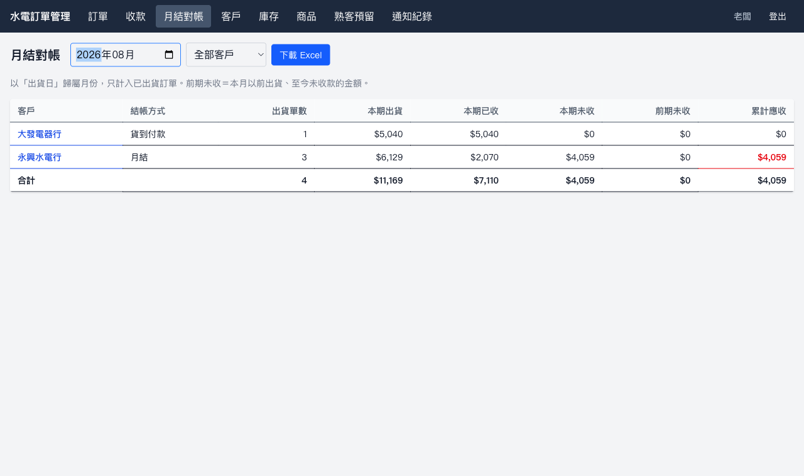
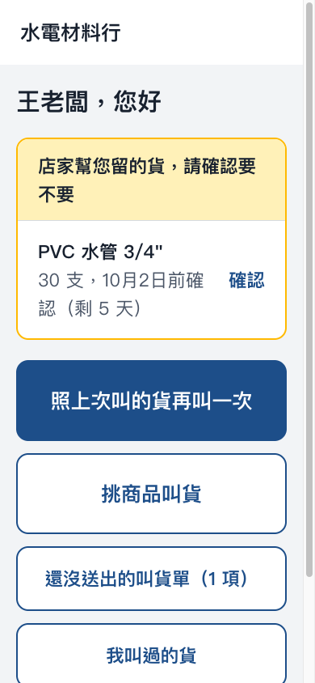
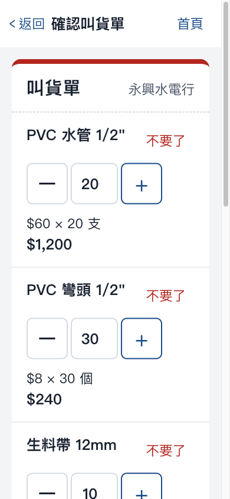
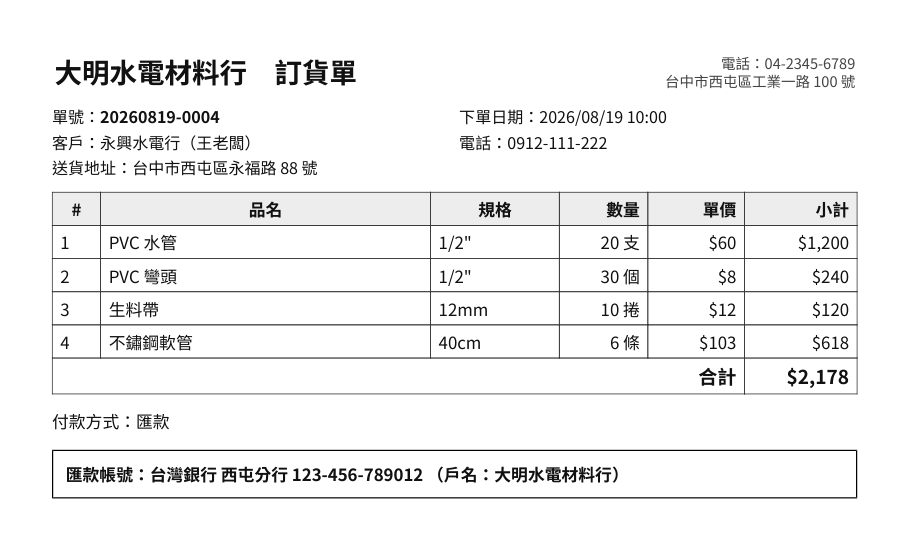
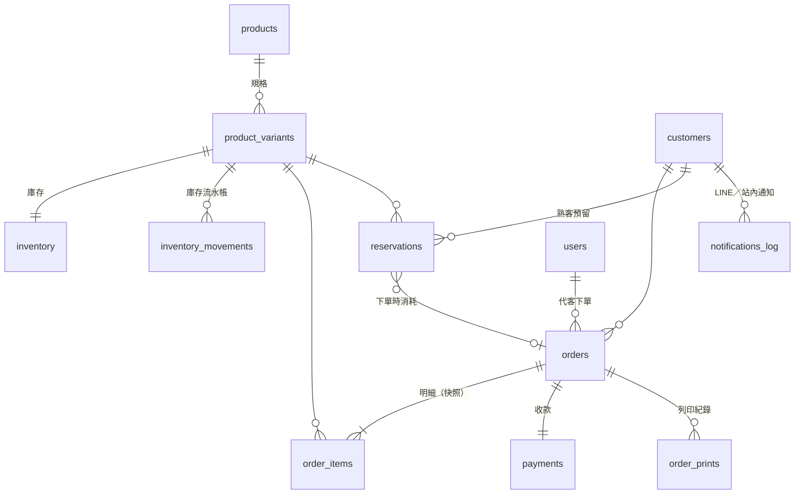

# 水電材料批發訂單管理系統

幫一家水電材料批發商，把「LINE 接單＋紙本＋Excel 對帳」換成一套內部管理後台，加上一個給熟客用手機自己叫貨的網頁。

- **內部**（老闆、兒子、工讀生）：訂單、庫存、熟客預留、收款、月結對帳、列印訂貨單
- **客戶**（約 50 家水電行，多為 50–60 歲師傅）：用 LINE 登入，照上次叫的貨一鍵再叫、查訂單與付款狀態

起因是一次對帳爭議：庫存記錯，雙方各說各話。所以這套系統的核心要求是**每一筆庫存與金額變動都查得到來源**，而且**不能超賣**。

| 管理後台：代客下單，一鍵帶入上次叫的貨 | 月結對帳 |
|---|---|
|  |  |

| 客戶端首頁（手機） | 送出前的叫貨單 | PDF 訂貨單 |
|---|---|---|
|  |  |  |

---

## 功能

**管理後台**
- 總覽（第二階段）：應收帳款、本月毛利與毛利率、帳齡（0–30／31–60／61–90／90 天以上）、每月出貨與收款趨勢、熱銷商品、應收最多的客戶
- 進貨（第二階段）：供應商、進貨單（先下單後到貨，或當場到貨直接入庫）、叫貨建議一鍵帶入進貨單；成本採移動加權平均
- 訂單：代客下單（含「老樣子」帶入最近 10 筆，標示改價／停售／超過可用量）、改單、確認、出貨、失效
- 庫存：可用量＝實際庫存−熟客預留−已下單未出貨；進貨／盤點調整需填原因，每筆異動留流水帳
- 熟客預留：為特定客戶保留數量與期限，到期前 7 天提醒、逾期自動釋放、複製為下一期
- 收款：標記已收（匯款／現金／支票含票號與兌現日）、月結客戶批次收款、誤按可撤銷
- 月結對帳：依出貨月份彙總本期／前期未收／累計應收，匯出 Excel
- PDF 訂貨單：下單即產生，補印內容與原單完全相同，記錄列印次數
- 客戶管理：產生 LINE 一次性綁定連結、解除綁定；LINE 通知紀錄與重送

**客戶端**（手機、LINE 內建瀏覽器）
- LINE 登入（不需帳號密碼），首次以店家傳來的綁定連結開通
- 照上次叫的貨一鍵帶入、挑商品叫貨（只顯示有貨／剩不多／缺貨）
- 送出前的「叫貨單」確認頁；連按送出也只成立一張單
- 查訂單進度與付款狀態、看／印訂貨單、確認店家預留的貨、店家通知

**通知**：訂單確認、預留即將到期，以 LINE 推播並同步寫入站內通知。

---

## 技術選型

| 項目 | 選用 | 版本 |
|---|---|---|
| 後端 | Laravel | 13.33 |
| 前端（管理端＋客戶端） | Vue 3＋vue-router、Vite、Tailwind CSS | 3.5／5.3／8.3／4.3 |
| API 認證 | Laravel Sanctum（同網域 session cookie） | 4.3 |
| 資料庫 | 開發 SQLite 3、正式 MySQL 8 | |
| PDF | mpdf＋Noto Sans TC | 8.3.1 |
| Excel | maatwebsite/excel（PhpSpreadsheet 5） | 4.0.3 |
| LINE | Messaging API（推播）、LINE Login（登入），以 Laravel Http client 直接呼叫 | v2 / v2.1 |

### 為什麼這樣選

- **Laravel＋Vue、一個專案兩個前端**：訂單與庫存邏輯只有一份（`app/Services`），內部代客下單與客戶自行下單走同一段程式，不會出現兩邊規則不一致。兩個前端各自一個 Vite entry，客戶端不會載入後台程式碼。
- **不做原生 App**：客戶每天都在用 LINE，通知走 LINE 推播比 App 內通知更會被看到；網頁從 LINE 聊天室的連結就能開啟，不必安裝、不必更新。
- **LINE Login 取代帳號密碼**：這個客群忘記密碼的機率高；綁定連結在 LINE 內建瀏覽器開啟時，通常一鍵同意即可登入。
- **mpdf 而非 dompdf**：以同一份訂單 HTML 實測，dompdf 只在空白處斷行，無空白的中文長句（地址、備註）會超出頁面被截斷；mpdf 正常換行。

  | | dompdf 3.1.6 | mpdf 8.3.1 |
  |---|---|---|
  | 中文、`mm²`、`1/2"` | ✅ | ✅ |
  | 中文長句換行 | ❌ 超出頁面被截斷 | ✅ |
  | 產出時間／檔案大小 | 0.15s／41KB | 0.09s／52KB |

- **LINE 直接用 Http client，不裝 line-bot-sdk**：SDK 自帶 Guzzle，`Http::fake` 攔不到，失敗情境無法測試；本專案只需推播與驗簽。
- **Sanctum session 模式**：SPA 與 API 同網域，用 cookie 即可，不必管理 token。

---

## 架構

```
Laravel 13
├── routes/api.php
│   ├── /api/admin/*      guard: web       內部人員（帳號密碼）
│   ├── /api/customer/*   guard: customer  客戶（LINE Login）＋綁定一致性檢查
│   └── /api/line/webhook                  LINE 平台（X-Line-Signature 驗簽）
├── routes/web.php        /admin/*、/*（兩個 SPA）、/auth/line*、/line/bind/{token}
├── app/Services/         InventoryService、OrderService、ReservationService、PaymentService、
│                         ReportService、OrderPdfService、CustomerNotifier、Line/*
└── resources/js/
    ├── admin/            管理端 SPA
    ├── customer/         客戶端 SPA
    └── shared/           共用 API 呼叫與格式化
```

---

## 資料庫



| 表 | 用途 |
|---|---|
| `products`／`product_variants` | 商品（25 品項）與規格（每項 3–6 種），單價以新台幣元整數儲存 |
| `inventory` | `on_hand` 實際庫存、`reserved` 熟客預留、`allocated` 已下單未出貨 |
| `inventory_movements` | 每次庫存異動的變化量、異動後數值、來源單據、操作人員、原因 |
| `customers` | 月結／貨到付款、LINE userId、一次性綁定 token、是否仍為官方帳號好友 |
| `orders`／`order_items` | 狀態：待確認→已確認→已出貨；待確認/已確認→已失效。明細保存品名、規格、單價快照 |
| `reservations` | 熟客預留數量與期限：預留中／已下單／已到期釋放／已取消 |
| `payments` | 每張訂單一筆，實收方式、時間、支票號碼與兌現日 |
| `suppliers`／`purchase_orders`／`purchase_order_items` | 供應商與進貨單（已下單未到貨／已到貨入庫／已取消），進價以 2 位小數儲存 |
| `product_variants.avg_cost`／`order_items.unit_cost` | 移動加權平均成本；出貨當下的成本快照，用於毛利 |
| `order_prints` | 每次列印／補印的人員與時間 |
| `notifications_log` | LINE 與站內通知；LINE 失敗原因、重送用的 retry key |

**庫存狀態流轉**（每個動作都寫入 `inventory_movements`）

| 動作 | on_hand | reserved | allocated |
|---|---|---|---|
| 進貨入庫 | +q | | |
| 盤點調整 | ± | | |
| 建立預留／預留到期或取消 | | +q／−q | |
| 下單（一般）／下單（使用自己的預留） | | ／−q | +q |
| 訂單失效 | | | −q |
| 出貨 | −q | | −q |

---

## 設計重點

- **防超賣不靠列鎖**：每次庫存異動是一個條件式原子 UPDATE（`WHERE on_hand + ? >= reserved + allocated + ?`），不成立就影響 0 列並丟出例外。SQLite 不支援 `SELECT … FOR UPDATE`，這個做法在 SQLite 與 MySQL 行為一致；條件移項成純加法，避免 MySQL unsigned 欄位出現負數中間值而報錯。以 20 個獨立 PHP process 搶 10 個庫存驗證恰好 10 筆成功。
- **補印不重新計算**：PDF 於下單／改單時存檔，列印一律讀檔；訂單明細存快照，日後改價、改匯款帳號都不影響補印。
- **改單只記差額、保留原單價**：流水帳不會出現一堆互相抵銷的紀錄；客戶不會因為改個數量就被套用新價格。
- **狀態轉換用條件式 UPDATE 搶下**：兩人同時確認同一張單、取消與到期排程同時處理同一筆預留，都只會有一方成功，不會重複釋放庫存。
- **重複送出只成立一張單**：客戶端進確認頁即產生 UUID，以（客戶, UUID）唯一索引擋下連點與網路重送。
- **客戶只看得到自己的資料**：客戶端 API 一律從登入客戶的關聯查詢，他人資料回 404；每支 API 都有越權測試，並以刻意改壞程式的方式確認測試抓得到。
- **LINE 推播不重複**：推播在 queue 中自動重試，每則通知固定一組 `X-Line-Retry-Key`，已送達的重試由 LINE 以 409 擋下。
- **解除綁定立即生效**：登入時把 LINE userId 存進 session，每個請求比對資料庫目前的綁定。
- **毛利不灌水**：成本採移動加權平均並於出貨時快照；上線前的舊單沒有成本，總覽只計有成本的出貨並顯示涵蓋率。
- **叫貨只建議不代決定**：目標量＝max(10, 近 30 天出貨量)，扣除可用量與在途量；勾選後帶入進貨單，由老闆確認送出。

---

## 安裝與環境設定

需求：PHP 8.3+（含 `pdo_sqlite`／`pdo_mysql`、`mbstring`、`gd`、`zip`）、Composer 2、Node.js 20.19+ 或 22.12+（Vite 8 要求）。產生 PDF 單次約需 66MB 記憶體，PHP `memory_limit` 至少 128M。

```bash
composer install
npm install
cp .env.example .env
php artisan key:generate
touch database/database.sqlite
php artisan migrate --seed            # 展示資料；或 --seeder=TrialSeeder 使用試用資料
npm run build                         # 開發時可用 npm run dev
```

執行時需要三個程序：

```bash
php artisan serve                     # 網站：/admin 管理後台、/ 客戶端
php artisan queue:work                # 發送 LINE 通知（未執行則通知停在「發送中」）
php artisan schedule:work             # 預留到期釋放（每小時）與提醒（每天 09:00）
```

正式環境以 Supervisor 常駐 `queue:work`，並以 cron 執行 `* * * * * php artisan schedule:run`。

### 環境變數

| 變數 | 說明 |
|---|---|
| `APP_URL` | 網站網址；LINE Login 回呼網址由此產生 |
| `DB_CONNECTION` 等 | 開發用 `sqlite`，正式用 `mysql` |
| `SHOP_NAME`、`SHOP_PHONE`、`SHOP_ADDRESS` | 顯示於 LINE 通知、PDF 訂貨單、客戶端 |
| `SHOP_BANK_NAME`、`SHOP_BANK_ACCOUNT`、`SHOP_BANK_ACCOUNT_NAME` | 匯款帳號，印在匯款訂單與通知上 |
| `LINE_CHANNEL_ACCESS_TOKEN`、`LINE_CHANNEL_SECRET` | Messaging API channel（推播、webhook 驗簽）。未設定時 LINE 通知記為「略過」，其餘功能正常 |
| `LINE_LOGIN_CHANNEL_ID`、`LINE_LOGIN_CHANNEL_SECRET` | LINE Login channel（客戶登入） |

### LINE 官方帳號（需店家本人申請）

1. 申請 LINE 官方帳號，於 LINE Developers Console 建立 Provider。
2. 在**同一個 Provider** 下建立 Messaging API channel 與 LINE Login channel（userId 依 Provider 區分，分屬不同 Provider 時登入取得的 userId 無法推播）。
3. LINE Login channel 的 Callback URL 設為 `{APP_URL}/auth/line/callback`，並連結官方帳號（登入時才會提示加好友）。
4. Messaging API 的 Webhook URL 設為 `{APP_URL}/api/line/webhook`（需 HTTPS）。

### 帳號

- `migrate --seed`：`admin@example.com` / `password`
- `--seeder=TrialSeeder`：`boss@trial.test`、`son@trial.test`、`staff@trial.test` / `trial1234`

尚未取得 LINE Login 金鑰時，本機（`APP_ENV=local`）可用 `/dev/customer-login/{客戶id}` 預覽客戶端；此路由在其他環境不存在。

---

## 測試

```bash
php artisan test        # 159 個測試
./vendor/bin/pint       # 程式碼格式
```

- **並發**：`InventoryConcurrencyTest` 以多個獨立 PHP process 同時搶購同一規格。
- **端對端**：`TrialScenarioTest` 以試用資料逐一走過 [試用劇本](docs/TRIAL_SCRIPT.md) 的 S1–S8，劇本與程式脫鉤時失敗。
- **外部服務**：LINE 以 `Http::fake` 模擬各種回應（成功、409、4xx、5xx、驗簽失敗）；PDF 驗證存檔內容與補印一致；Excel 讀回實際檔案檢查公式與 0 值。

---

## 開發歷程

### 第一階段：MVP（2026-09）

需求訪談後先把會反覆被問的事定案（見 `CLAUDE.md`「已定案決策」），例如「老樣子」用最近 10 筆而不做常用組合設定、定期訂單只提醒不自動成立。開發依 [執行計畫](docs/DEVELOPMENT_PLAN.md) 的步驟進行，每步測試通過才進下一步：

1. 資料庫設計：庫存拆成三欄、補上原計畫沒有的 `inventory_movements`，直接回應「庫存記錯導致爭議」的痛點
2. 庫存與熟客預留：條件式原子 UPDATE 防超賣、並發測試
3. 訂單：代客下單、老樣子、狀態流轉、客戶管理與 LINE 綁定連結
4. 收款與月結對帳、Excel 匯出
5. LINE 推播與 webhook
6. PDF 訂貨單（dompdf／mpdf 實測後選 mpdf）
7. 客戶端：LINE Login、叫貨流程、依中高齡使用習慣設計（整體放大 125%、按鈕 64px 以上、送出前叫貨單確認）
8. 試用準備：試用資料、試用劇本、端對端測試

實作中每個模組都實際開瀏覽器、打開產出的 PDF 與 Excel 驗證，抓到多個自動測試抓不到的問題，例如：換網域就無法登入（Sanctum stateful 網域設定）、Excel 中 0 元被寫成空白格、dompdf 截斷中文長句、手機上訂單編號在連字號斷行、被登出時停在空白畫面。

### 第二階段：優化期

- ✅ **對帳報表視覺化**：後台總覽。圖表以 Vue 直接繪製 SVG（未引入圖表套件），色票經色盲模擬驗證，每張圖都有鍵盤可操作的提示框與表格檢視
- ✅ **進貨管理**：供應商、進貨單兩種到貨模式、移動加權平均成本、叫貨建議、總覽毛利
- ✅ **Web Push 評估**：[結論為不實作](docs/WEB_PUSH_EVALUATION.md)——客戶在 LINE 內建瀏覽器收不到，改為控制 LINE 推播則數
- 客戶端 UI/UX 依熟客試用回饋調整（待試用）
- 客戶端常用組合（若年輕客戶有需求）

---

## 已知限制

- **尚未部署**：並發測試目前在 SQLite 上執行（SQLite 會序列化寫入），上線前需在 MySQL 8 重跑完整測試。
- **LINE 尚未以真實帳號實測**：推播、webhook、LINE Login 依官方規格實作並以模擬回應測試，需待店家申請完成後實測。
- **熟客試用尚未進行**：中高齡介面的字級、按鈕大小等數值為實作採用值，尚無使用者觀察；見 [試用劇本](docs/TRIAL_SCRIPT.md) 與 [回饋表](docs/feedback.md)。
- 客戶送出後不能自行改單（需電話聯絡店家）；一個客戶只能綁定一個 LINE 帳號。
- Excel 下載的中文檔名在極舊的瀏覽器會顯示為 `_2026-09.xlsx`。
- **時區固定為 Asia/Taipei**：Laravel 以 app 時區寫入資料庫（存的是台北時間），API 輸出時轉為 UTC。上線後不可更改 `config/app.php` 的 timezone，否則既有時間全部位移。
- 管理後台只有淺色模式；總覽圖表的色票僅驗證過白色背景。
- 進貨單一次整張到貨入庫，尚不支援分批到貨；不管理應付帳款（欠供應商的錢）。
- 第一階段刻意不做：進貨／供應商管理、多倉庫、發票與稅務系統串接、定期訂單自動產生、原生 App。

---

## 文件

| 文件 | 內容 |
|---|---|
| [`reference/`](reference/) | 原始開發計畫書 |
| [`CLAUDE.md`](CLAUDE.md) | 已定案決策與開發規範 |
| [`docs/DEVELOPMENT_PLAN.md`](docs/DEVELOPMENT_PLAN.md) | 執行計畫與各步驟完成狀態 |
| [`docs/TRIAL_SCRIPT.md`](docs/TRIAL_SCRIPT.md) | 熟客試用劇本（S1–S8） |
| [`docs/feedback.md`](docs/feedback.md) | 試用回饋表 |
| [`docs/WEB_PUSH_EVALUATION.md`](docs/WEB_PUSH_EVALUATION.md) | Web Push 通知評估 |

字型 Noto Sans TC 以 SIL Open Font License 1.1 授權，授權檔位於 `resources/fonts/NotoSansTC/OFL.txt`。
